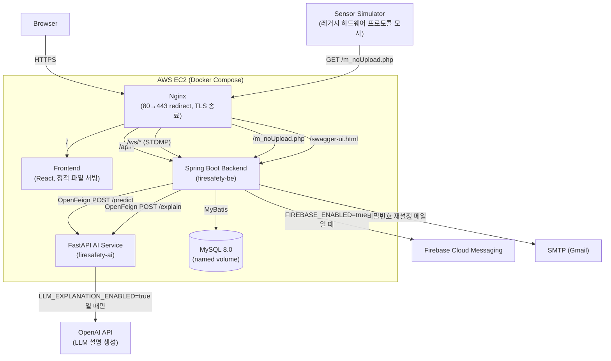
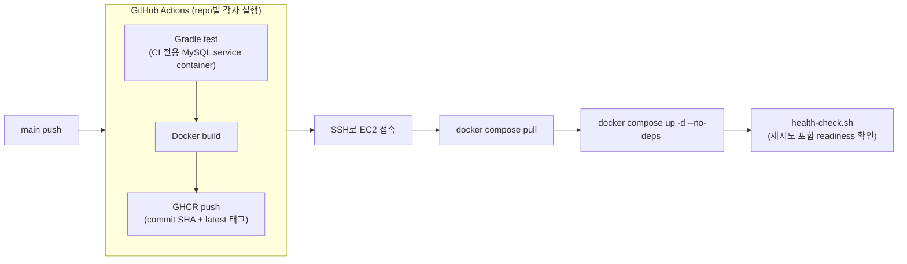
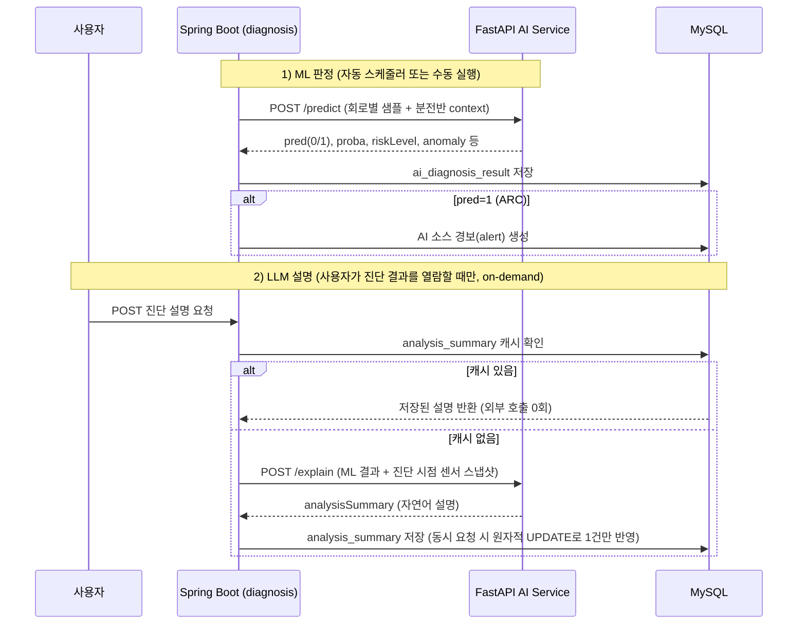

# ⚡ ArcGuard

산업 현장 분전반의 센서 데이터(전류·누설전류·온도·습도 등)를 수집해 하드웨어 판정과 AI 아크(arc) 판정을 종합하고, 실시간 관제화면과 경보(FCM 푸시 포함)로 이어주는 전기화재 예방 스마트 진단·모니터링 시스템의 백엔드다. 단일 Spring Boot 애플리케이션 안에서 도메인 패키지로 분리한 **Modular Monolith** 구조로 만들었다.

스마트팩토리/MES 분야의 현장 설비 데이터 수집·모니터링 구조에 관심을 가지면서, 단순 CRUD가 아니라 "센서 수신 → 하드웨어/AI 판정 → 실시간 관제 → 경보"로 이어지는 실제 산업 현장 데이터 흐름을 가정하고 설계·구현했다. 실제 하드웨어는 없어 레거시 프로토콜을 그대로 흉내 낸 Sensor Simulator로 데이터를 흘려보낸다.

이 저장소(`firesafety-be`)는 세 개의 ArcGuard 저장소 중 가장 상세한 메인 프로젝트 README를 담당한다.

---

## 목차

- [Live Demo](#live-demo)
- [Architecture](#architecture)
- [핵심 기능](#핵심-기능)
- [Domain / Module 구성](#domain--module-구성)
- [AI Integration](#ai-integration)
- [Sensor Data Flow](#sensor-data-flow)
- [Authentication & Security](#authentication--security)
- [Engineering Highlights](#engineering-highlights)
- [Tech Stack](#tech-stack)
- [Deployment & CI/CD](#deployment--cicd)
- [Repository](#repository)
- [Local Setup](#local-setup)
- [Test](#test)
- [Production QA](#production-qa)
- [Project Scope & Limitations](#project-scope--limitations)

---

## Live Demo

**Production: https://arcguard.duckdns.org**

| 항목 | 값 |
|---|---|
| API 문서 (Swagger UI) | https://arcguard.duckdns.org/swagger-ui.html |
| 인증 | HTTPS (Let's Encrypt) |

### Demo 계정

| 역할 | 이메일 | 비밀번호 |
|---|---|---|
| 관리자 | admin1@arcguard.com | test1234! |
| 일반 사용자 | user1@arcguard.com | test1234! |

두 계정 모두 `ArcGuard 테스트 현장` 하나에만 접근 권한이 배정되어 있고, 그 현장 아래 테스트 분전반에는 Sensor Simulator로 실제 생성한 센서 데이터·경보·AI 진단·점검 이력이 남아 있어 로그인 직후 빈 화면이 아니라 실제 데이터를 볼 수 있다. 운영 관리자(SUPER_ADMIN) 계정은 보안상 이 문서에 공개하지 않는다.

---

## Architecture

### 런타임 구조



- `ai-service`와 `mysql`은 Docker 내부망(`arcguard-net`)에만 존재하고 호스트 포트로 노출되지 않는다. 외부에 열린 포트는 nginx의 80/443뿐이다.
- MySQL은 RDS가 아니라 Compose 안에서 직접 운영하며, 관리 접근은 `127.0.0.1:23306` 루프백 바인딩 + SSH 터널로만 가능하다.

### 배포 파이프라인 (3개 저장소 각자 독립 배포)



- backend push는 `arcguard-backend` 컨테이너만, frontend push는 frontend+nginx만, ai-service push는 `arcguard-ai` 컨테이너만 재배포한다 — 서로 다른 서비스를 건드리지 않는다.
- EC2는 소스를 빌드하지 않는다(gradle/npm/pip 실행 없음). GHCR에서 이미지를 pull만 한다.

---

## 핵심 기능

실제 컨트롤러/서비스 코드에 존재하는 기능만 정리한다.

- **인증/계정**: 로그인·로그아웃, Access/Refresh Token 재발급, 비밀번호 재설정(이메일 링크, rate limit), SUPER_ADMIN/ADMIN/GENERAL 3단계 계층 기반 계정 CRUD·소프트삭제·복구, 사용자 감사 로그(`user_audit_log`)
- **현장/설비 관리**: 현장·분전반·회로 CRUD, 담당 현장 배정(`user_site`), 도로명주소 검색 연동(행정안전부 Juso API), 설비 감사 로그(`facility_audit_log`)
- **센서 수신**: 레거시 프로토콜 전용 엔드포인트(`GET /m_noUpload.php`)로 쿼리스트링 프레임 수신·검증·파싱, 하드웨어 없이 데모하기 위한 Mock 센서 스케줄러
- **AI 진단**: FastAPI AI 서버(`POST /predict`) 연동 자동/수동 진단 실행, ARC 판정 시 AI 소스 경보 자동 생성, 진단 결과에 대한 LLM 설명(`POST /explain`) on-demand 생성 + DB 캐시
- **실시간 관제**: 대시보드 요약 REST + WebSocket(STOMP) 실시간 갱신, 분전반 상태(`panel.status`) 조회 시점 계산이 아닌 프레임 수신 시점 집계 저장, 1분 기준 통신두절 감지
- **경보**: 경보 상태 3단계 전이(UNCONFIRMED → CONFIRMED → RESOLVED, 순서 강제), 경보 소스(DEVICE/AI/SYSTEM) 구분, 심각도(severity) 필드, FCM 멀티기기 푸시(`user_fcm_token`), 대량 확인/조치 API, 엑셀 다운로드
- **점검 관리**: 현장별 점검 항목 카탈로그, 분전반 점검 결과 저장·이력 조회, 엑셀 내보내기
- **통계**: 기간별 경보/진단/점검 건수, 일별 해결률, 예방조치 이행률(주의(CAUTION) 알림 기준) 통계 조회
- **시스템**: SW 버전/업데이트 이력 조회(`GET /api/system/version`) — 버전 정보는 환경변수 정적 값, 이력은 배포 시 DB에 직접 INSERT하는 방식으로 관리(등록 API는 의도적으로 미제공)

---

## Domain / Module 구성

경계는 네트워크 서비스가 아니라 패키지 기준이다. Controller는 자기 도메인 Application Service만 호출하고, 다른 도메인 Mapper를 직접 호출하지 않는다.

| 패키지 | 역할 |
|---|---|
| `common` | 공통 응답(`ResultResponse`), 에러코드, 예외 처리 |
| `config` | JWT/Security/CORS/WebSocket/Firebase/Swagger 등 인프라 설정 |
| `auth` | 로그인/로그아웃/재발급, 계정 CRUD·소프트삭제·복구, 비밀번호 재설정, 부트스트랩 SUPER_ADMIN |
| `facility` | 현장/분전반/회로 CRUD, 담당현장배정, 주소 검색, 설비 감사 로그 |
| `sensor` | 하드웨어 센서 데이터 수신(`GET /m_noUpload.php`), Mock 센서 스케줄러 |
| `diagnosis` | AI 서버(`/predict`, `/explain`) 연동, 회로별 진단 결과·설명 저장/조회 |
| `monitoring` | 대시보드 요약, WebSocket 실시간 갱신, 분전반 상태 집계, 통신두절 감지 |
| `alert` | 경보 생성/조회, 상태 전이, FCM 발송, 엑셀 다운로드 |
| `inspection` | 현장별 점검 항목 카탈로그, 점검 결과 저장·이력·엑셀 내보내기 |
| `statistics` | 기간별 경보/진단/점검 통계, 이행률 조회 |
| `system` | SW 버전/업데이트 이력 조회 |

---

## AI Integration

Backend 입장에서 AI 연동은 **판정(ML)**과 **설명(LLM)** 두 축으로 분리되어 있고, 둘은 서로 독립적으로 실패한다. ML 판정은 firesafety-ai의 4개 모델 출력을 그대로 저장한다 — ① ARC Classifier(`pred`/`proba`, ARC 여부), ② Risk Classifier(`riskLevel`/`riskScore`, 종합 위험 수준 — `riskScore`는 화재 확률이 아님), ③ Anomaly Detector(`anomaly`/`anomalyScore`, 정상 패턴에서 벗어났는지), ④ Next-current Regressor(`predictedCurrent`, 다음 sample 시점의 예상 전류 — 시간 단위 아님). LLM은 이 값들을 재판정하지 않고 자연어로 설명만 한다("ML decides, LLM explains").



- **LLM은 위험을 판정하지 않는다.** ML(`/predict`)이 이미 저장한 `verdict`/`riskLevel`/`anomaly` 등을 그대로 인용해 자연어로 풀어 설명하는 역할만 한다(`AiDiagnosisExplanationService`).
- **ARC 경보는 legacy `pred=1`(ARC) 판정에만 연결된다.** 확장 필드인 `riskLevel=DANGER`나 `anomaly=true`는 별도 신호일 뿐, ARC 경보로 강제 변환하지 않는다 — 서로 다른 의미의 판정을 섞지 않기 위한 설계 결정이다.
- 설명은 사용자가 실제로 조회할 때만 생성되고(스케줄러/자동 생성 없음), 한 번 생성되면 DB에 캐시되어 이후 같은 진단 결과 조회는 AI 서버를 다시 호출하지 않는다.
- 외부 호출은 Spring Cloud **OpenFeign**으로 처리하며, `AI_PREDICTION_ENABLED`/`AI_EXPLANATION_ENABLED` 두 플래그로 각각 독립적으로 켜고 끌 수 있다.

---

## Sensor Data Flow

실제 하드웨어 대신, 실제 하드웨어 프로토콜을 가정한 **Sensor Simulator**로 데이터를 흘려보낸다.

```
Sensor Simulator
  → GET /m_noUpload.php?m_no=00001&mode=0&volt=230&am1=023&...  (표준 REST가 아닌 레거시 쿼리스트링 프로토콜)
  → SensorIngestController: 필드 자리수 검증 → 파싱
  → sensor_frame / sensor_frame_circuit 저장 (MySQL)
  → PanelStatusAggregationService: 회로별 하드웨어 판정 종합 → panel.status 집계
  → AiPredictionScheduler: 샘플이 충분히 쌓인 분전반을 주기적으로 AI 서버에 전송
  → React 관제화면: REST(최초 진입) + WebSocket(STOMP, 이후 실시간 갱신)
```

- `GET /m_noUpload.php`는 표준 REST 컨벤션(`/api/...`)을 따르지 않는 예외 경로다. 실제 하드웨어가 쿼리스트링(필드별 고정 자리수, 전부 문자열)으로 직접 호출하는 프로토콜을 그대로 재현했기 때문에 임의로 바꾸지 않는다.
- 필드 자리수 누락/불일치는 원본 쿼리값을 로그에만 보관하고 400으로 응답한다(하드웨어 원인 추적용). `tem`/`humi`는 영하 값이 가능해 부호를 제외한 자리수만 검증한다.
- 회로가 삭제/미등록인 채널은 그 채널만 건너뛰고 나머지 채널/프레임 저장은 정상 진행한다.
- 실제 하드웨어 없이 발표/데모가 가능하도록 `SENSOR_MOCK_ENABLED=true`면 활성 분전반 기준으로 가짜 프레임을 주기적으로 생성해 **동일한 수신 흐름**(검증 → 저장 → 집계 → AI → 경보)에 그대로 태운다. 운영에서는 항상 `false`.

---

## Authentication & Security

- **비밀번호**: BCrypt 해시 저장(`PasswordEncoderConfig`).
- **토큰**: JWT(`jjwt`) 기반 Access/Refresh Token, `HttpOnly` 쿠키(`at`/`rt`)로 전달 — 프론트 JS가 토큰 값에 직접 접근할 수 없다.
- **Refresh Token**: 원문을 저장하지 않고 **SHA-256 해시**만 DB(`refresh_token` 테이블)에 저장(`TokenHashUtil`), 재발급 시 해시로 조회·검증한다. 비밀번호 재설정 토큰(`password_reset_token`)도 동일하게 원문 미저장·해시만 저장.
- **쿠키 속성**: 운영 환경은 `Secure=true`(HTTPS 전환 후 적용), `SameSite=Lax`. 로컬/HTTP 단계에서는 `Secure=false`로 낮출 수 있게 환경변수로 분리했다.
- **권한 기반 접근 제어**: SUPER_ADMIN ⊃ ADMIN ⊃ GENERAL 3단계 계층. 요청 Body/Query/Header에 실린 role·siteId는 신뢰하지 않고, 항상 인증된 userId로 DB를 재조회해 접근 범위를 검증한다.
- **Security 필터 예외 처리**: 필터 단계 인증 예외는 `request.setAttribute("exception", e)` → `JwtAuthenticationEntryPoint` → `GlobalExceptionHandler` 경로로 일관되게 처리한다.
- **Firebase Admin SDK**: 인증 JSON을 이미지/저장소/GHCR 어디에도 포함하지 않고, EC2 호스트의 별도 경로에서 읽기 전용으로 컨테이너에 마운트한다.
- **비밀 값 분리**: DB 비밀번호, JWT 시크릿, SMTP 계정, Firebase 인증 정보, OpenAI API Key(AI 서버 전용) 전부 `.env`/`.env.production`으로 분리하고 Git에 커밋하지 않는다(`.gitignore` 처리, 예시 파일만 커밋).
- **네트워크 격리**: backend/ai-service/MySQL은 호스트 포트로 노출되지 않고 Docker 내부망에서만 접근 가능하다. MySQL은 관리용으로만 루프백(`127.0.0.1:23306`)에 바인딩되어 SSH 터널을 거쳐야 접근할 수 있다.
- **전송 구간**: Let's Encrypt 인증서로 HTTPS 적용, HTTP(80)는 ACME challenge 응답을 제외하고 전부 443으로 redirect.

---

## Engineering Highlights

단순 기능 나열이 아니라, 실제로 겪은 문제와 그 해결 과정을 정리한다.

### 1. CI에서 `contextLoads()`가 실패하는 문제 — production secret 없이 실제 마이그레이션까지 검증하기

- **문제**: 전체 Spring Context(DataSource/Flyway/MyBatis 포함)를 띄우는 `contextLoads()` 테스트가 GitHub Actions에서 실패했다.
- **원인**: 로컬에서는 `.env`를 직접 읽어 통과했지만, `.env`는 `.gitignore` 대상이라 CI 체크아웃에는 존재하지 않았다.
- **해결**: production MySQL/credential을 CI로 끌어오는 대신, GitHub Actions 워크플로에 **CI 전용 `mysql:8.0` service container**와 CI 전용 더미 `DB_USERNAME`/`DB_PASSWORD`/`JWT_SECRET_KEY`를 주입해, production과 동일한 MySQL 엔진으로 실제 Flyway 마이그레이션·MyBatis 매퍼까지 검증했다.
- **결과**: production 자격 증명을 전혀 노출하지 않으면서도 "빌드만 되면 통과"가 아니라 실제 DB 스키마 적용까지 CI가 검증하는 구조를 확보했다.

### 2. 컨테이너가 떴다고 서비스가 준비된 건 아니다 — AI 서비스 헬스체크의 IPv6 함정

- **문제**: AI 서비스(FastAPI, 모델 4개 로드 + uvicorn bind)가 배포 직후 헬스체크에서 원인 불명 에러로 실패했다.
- **원인**: 컨테이너 안에서 `localhost`는 `127.0.0.1`과 `::1` 둘 다로 resolve되는데, 이 컨테이너는 IPv6가 비활성화돼 있어 `127.0.0.1` 실패 후 `::1` 폴백 시도가 `Cannot assign requested address`로 죽으면서 원래 원인을 가렸다. 또한 "container Started"와 "FastAPI가 실제로 요청을 받을 준비" 사이에는 시간 차가 있다.
- **해결**: 헬스체크 URL을 `127.0.0.1`로 명시해 IPv6 후보 자체를 시도하지 않게 하고, 즉시 실패 처리 대신 짧은 간격(2초)으로 최대 10회 재시도하는 readiness 체크(`health-check.sh`)로 바꿨다. backend/frontend 헬스체크에도 동일한 재시도 패턴을 적용했다.
- **결과**: "컨테이너 기동 성공"이 아니라 "실제로 응답 가능"을 배포 성공 기준으로 삼게 되어, 배포 직후 뜬 것처럼 보이지만 실제로는 요청을 못 받는 상태를 CI가 실패로 잡아낸다.

### 3. 부트스트랩 순서 문제 — nginx가 없는데 nginx를 거쳐 검증하면 안 된다

- **문제**: 3개 저장소가 독립 배포되는 구조에서, 최초 배포(AI → Backend → Frontend 순) 시점에는 아직 nginx가 존재하지 않는데도 backend 헬스체크가 nginx를 경유해 확인하려다 실패했다.
- **원인**: nginx는 frontend 저장소가 소유한 서비스라 frontend가 먼저 배포된 뒤에야 등장한다. nginx 설정 자체도 upstream(`frontend`/`backend`)을 시작 시점에 resolve하기 때문에, 대상 컨테이너가 없으면 nginx 기동 자체가 거부된다.
- **해결**: backend 헬스체크는 nginx를 거치지 않고 컨테이너 자체에 직접(`docker compose exec backend`) 접근해 검증하도록 분리했고, nginx를 경유하는 통합 확인(`nginx → backend`, `nginx → frontend`)은 nginx가 반드시 존재하는 시점인 frontend 배포 단계로 옮겼다.
- **결과**: 서비스별 독립 배포 순서(AI → Backend → Frontend)와 헬스체크 책임 범위가 일치하게 되어, 최초 부트스트랩과 이후의 부분 재배포 모두 같은 스크립트로 안전하게 처리된다.

### 4. 동시 요청이 LLM 설명을 두 번 저장하지 않게 하기

- **문제**: 진단 결과의 LLM 설명(`analysis_summary`)은 사용자가 조회할 때 없으면 그 자리에서 생성해 캐시하는 구조인데, 같은 진단 결과를 여러 사용자(또는 같은 사용자의 중복 클릭)가 동시에 처음 열람하면 둘 다 "캐시 없음"을 보고 각자 AI 서버를 호출할 수 있다.
- **원인**: "캐시 확인 → 없으면 생성 → 저장"이 하나의 원자적 연산이 아니라 조회와 쓰기 사이에 시간차가 있는 전형적인 TOCTOU(check-then-act) 상황이었다.
- **해결**: 저장을 `UPDATE ... WHERE analysis_summary IS NULL` 조건의 원자적 쿼리로 처리해, 동시에 여러 요청이 생성을 시도해도 DB에는 한쪽만 실제로 반영되게 했다. 저장에 진 쪽은 자신이 만든 값 대신 DB에 이미 저장된 값을 반환해, DB를 단일 진실 소스로 유지한다.
- **결과**: 최소한 DB 데이터 정합성(같은 진단에 서로 다른 설명이 남는 문제)은 원천 차단했다. 다만 이 방식이 AI 서버로의 중복 외부 호출 자체를 막지는 못한다는 한계는 남아 있다(TBD).

### 5. "최근 N건" 목록 밖의 경보를 클릭하면 다른 경보가 처리되던 문제

- **문제**: 모바일 설비 상세 화면에서 알림 목록의 특정 경보를 클릭해 들어갔는데, 화면에 뜬 "조치완료" 버튼을 누르면 클릭한 경보가 아니라 그 시점에 가장 최근 발생한 다른 경보가 처리되는 경우가 있었다. 사용자 확인 결과로 처음 발견했다.
- **원인**: 프론트가 해당 분전반의 "최근 5건" 경보만 조회한 뒤, 그 안에서 클릭한 alertId를 못 찾으면 조용히 "최근 5건 중 미해결 최신 건"으로 대체 표시하는 fallback 로직이 있었다 — 목록이 짧은 시간에 여러 건 새로 쌓이면 원래 클릭한 경보가 그 창 밖으로 밀려나면서 재현됐다.
- **해결**: `GET /api/alerts`에 `alertId` 단건 필터를 추가해(기존 목록 조회 API 재사용, 권한 검증 로직도 그대로 적용됨) 프론트가 클릭한 경보를 항상 정확히 그 ID로 재조회하도록 바꾸고, "최근 N건" fallback을 완전히 제거했다. 못 찾음/이미 처리됨 상태도 다른 경보로 대체하지 않고 명시적으로 구분해서 보여준다.
- **결과**: Mapper 단위 회귀 테스트를 추가했고, production에서 오래된 경보 1건을 실제로 지정해 그것만 처리되고 다른 최신 경보는 그대로인지 API/DB 양쪽으로 재검증했다.

### 6. HTTPS 전환 — 인증서 발급과 갱신을 배포 파이프라인에 편입하기

- **문제**: 로그인 등 민감한 트래픽이 HTTP로 오가는 1차 배포 상태를 HTTPS로 전환해야 했고, 인증서 발급/갱신을 사람이 수동으로 챙기지 않아도 되게 만들어야 했다.
- **해결**: `certbot`을 상시 기동 서비스가 아니라 `docker compose run --rm certbot ...`으로 1회성 실행하는 구조로 두고, webroot(`/var/www/certbot`) 방식으로 nginx와 인증서 발급 요청을 공유했다. 발급 후에는 nginx를 80(ACME challenge + redirect 전용)과 443(TLS 종료)으로 분리했다. 갱신은 매일 새벽 systemd timer가 `certbot renew`를 실행하되(만료 임박한 것만 실제로 갱신됨), `-T` 플래그 없이 비대화형 실행 시 멈추는 문제를 실제로 겪은 뒤 dry-run으로 검증해 반영했다.
- **결과**: 사람 개입 없이 인증서가 자동 갱신되는 HTTPS 운영 환경을 구성했고, `JWT_COOKIE_SECURE`/`CORS_ALLOWED_ORIGINS`를 HTTPS 기준 값으로 전환했다.

---

## Tech Stack

| 구분 | 기술 |
|---|---|
| Language / Runtime | Java 21 |
| Framework | Spring Boot 4.0.7 (WebMVC) |
| Security | Spring Security, JWT(`jjwt` 0.12.6), BCrypt |
| Persistence | MyBatis (`mybatis-spring-boot-starter` 4.0.1), MySQL 8.0 |
| Migration | Flyway (`flyway-mysql`) |
| Realtime | WebSocket (STOMP) |
| External API | Spring Cloud OpenFeign 5.0.2 (AI 예측/설명 서버, 도로명주소 검색 API) |
| Notification | Firebase Admin SDK 9.4.3 (FCM), Spring Mail (SMTP) |
| API Docs | springdoc-openapi 2.8.9 (Swagger UI) |
| Excel | Apache POI 5.3.0 (경보/점검 이력 다운로드) |
| Env | dotenv-java 3.0.0 (`.env`를 UTF-8로 직접 읽어 인코딩 문제 방지) |
| Build | Gradle (`./gradlew`) |
| Infrastructure | AWS EC2 (Amazon Linux 2023), Docker Compose, Nginx, Let's Encrypt/Certbot, DuckDNS |
| CI/CD | GitHub Actions, GHCR (GitHub Container Registry) |

---

## Deployment & CI/CD

- **인프라**: AWS EC2(Amazon Linux 2023) 위에서 Docker Compose로 nginx/frontend/backend/ai-service/mysql 5개 컨테이너를 운영한다. MySQL은 관리형(RDS)이 아니라 컨테이너로 직접 운영하며, named volume(`arcguard-mysql-data`)으로 컨테이너 교체와 무관하게 데이터를 보존한다.
- **도메인/TLS**: DuckDNS(`arcguard.duckdns.org`) + Let's Encrypt 인증서, systemd timer 기반 자동 갱신.
- **CI/CD**: 3개 저장소(frontend/backend/ai-service)가 각자 GitHub Actions로 테스트 → Docker 이미지 빌드 → GHCR push → EC2 SSH 접속 후 해당 서비스만 `pull` + `up -d --no-deps` + 헬스체크. 한 저장소에 push해도 다른 서비스는 재배포되지 않는다. EC2에서는 소스 빌드를 하지 않는다.
- **포트 정책**: 외부 공개는 80/443(nginx)뿐이다. 관리용 SSH(22)만 별도로 열려 있고, backend(8080)/ai-service(8000)/MySQL(3306)은 컨테이너 내부망에서만 접근 가능하다. MySQL은 관리 도구 접근을 위해 루프백(`127.0.0.1:23306`)에만 바인딩되어 있어, Workbench 등으로 접속하려면 반드시 SSH 터널을 거쳐야 한다.
- **롤백/백업**: 이전 커밋 SHA 태그로 롤백하는 스크립트(`deploy/scripts/rollback.sh`), 수동 DB 백업 스크립트(`deploy/scripts/backup-db.sh`)를 제공한다.

---

## Repository

| 저장소 | 역할 |
|---|---|
| [firesafety-be](https://github.com/soyoung-v/firesafety-be) | 백엔드 — Spring Boot Modular Monolith (이 저장소) |
| [firesafety-fe-react](https://github.com/soyoung-v/firesafety-fe-react) | 프론트엔드 — React 기반 관제/관리 화면 |
| [firesafety-ai](https://github.com/soyoung-v/firesafety-ai) | AI 서버 — FastAPI 기반 아크 판정(`/predict`) 및 진단 설명(`/explain`) |

---

## Local Setup

### 사전 요구사항

- Java 21
- MySQL (로컬 실행 또는 원격 접속 정보)

### 1. 환경변수 설정

```bash
cp .env.example .env
# .env를 열어 DB_URL/DB_USERNAME/DB_PASSWORD, JWT_SECRET_KEY, MAIL_* 등 실제 값으로 채운다
```

`.env`는 Java Properties가 아니라 `dotenv-java`로 직접 읽으므로 한글 값을 그대로 써도 된다. 운영 배포용 값은 `.env.production.example`을 기준으로 서버에서만 채운다(이 저장소에는 실제 값이 포함되지 않는다).

### 2. 서버 실행

```bash
./gradlew bootRun
```

기동 시 Flyway가 마이그레이션을 자동 적용하고, `BOOTSTRAP_SUPER_ADMIN_ENABLED=true`면 마스터 계정을 자동 생성한다.

### 3. 하드웨어 없이 데모하기 (Mock 센서)

```bash
SENSOR_MOCK_ENABLED=true   # .env에서 설정
SENSOR_MOCK_DELAY_MS=5000  # 생성 주기(ms)
```

활성 분전반이 있으면 실제 장비 없이도 센서 프레임 → 경보 → 대시보드/WebSocket 갱신까지 기존 수신 흐름 그대로 태운다. 운영에서는 반드시 `false`.

### 4. Docker(운영 구조 재현)

로컬에서 운영과 동일한 컨테이너 구조를 재현하려면 `docker-compose.yml` + `deploy/`를 참고한다. 실제 비밀 값(`​.env.production`, Firebase Admin SDK JSON)은 저장소에 없으므로 각자 `.env.production.example`을 기준으로 채워야 한다.

### 문서/테스트 계정 (local 전용)

| 항목 | 값 |
|---|---|
| Swagger UI | `http://localhost:8080/swagger-ui.html` |
| SUPER_ADMIN 부트스트랩 | `BOOTSTRAP_SUPER_ADMIN_ENABLED=true`로 두면 `.env`에 직접 설정한 이메일/비밀번호로 SUPER_ADMIN 계정이 로컬에서 자동 생성된다. 실제 credential은 이 저장소에 포함하지 않는다. |

그 외 ADMIN/GENERAL 계정은 로그인 후 SUPER_ADMIN → ADMIN → GENERAL 순으로 직접 등록해서 사용한다. Production Demo 계정은 위 [Live Demo](#live-demo)의 `admin1@arcguard.com` / `user1@arcguard.com`만 공개한다.

---

## Test

```bash
./gradlew test
./gradlew clean build
```

이번 검증 시점(2026-09-03) 기준 `./gradlew test`는 **총 199개 테스트 전부 통과**했다. CI(GitHub Actions)에서도 동일하게 `mysql:8.0` service container로 실제 Flyway 마이그레이션까지 검증한 뒤 이미지를 빌드한다.

---

## Production QA

포트폴리오 제출 전 실제 production 환경(https://arcguard.duckdns.org)을 대상으로 진행한 최종 QA에서 아래 항목을 직접 확인했다(상세 TC 문서는 저장소에 포함하지 않음).

- HTTPS 강제(HTTP→HTTPS 301) + Let's Encrypt 인증서 자동 갱신
- 쿠키 `Secure`/`HttpOnly`/`SameSite` 속성, CORS(운영 도메인만 허용)
- 인증 없는 요청 401 / 권한 밖 요청 403 (역할별 API 직접 호출로 재검증)
- Docker 헬스체크, 공개 포트 제한(80/443/22만 외부 노출)
- Sensor Simulator 6개 시나리오(NORMAL/ARC/LEAKAGE/OVERHEATING/OVER_CURRENT/COMPLEX_RISK) 전 구간 E2E — 실제 수신 → 저장 → AI 4개 모델 판정 → 경보 생성까지
- LLM 설명 생성 + DB 캐시(동일 진단 재조회 시 OpenAI 재호출 없음)
- Firebase Web Push — iPhone 홈 화면 PWA에서 실제 수신 확인
- 경보 상태 전이(UNCONFIRMED→CONFIRMED→RESOLVED), 설비 등록 검증, 점검, 통계 기능

---

## Project Scope & Limitations

- 개인 포트폴리오 프로젝트이며, 실제 인증을 받은 전기화재 안전 시스템이 아니다.
- 실제 센서 하드웨어 대신 레거시 프로토콜을 모사한 **Sensor Simulator**로 데이터를 생성한다.
- AI 학습/추론에 쓰인 데이터는 synthetic(합성) 데이터다.
- ML 판정 결과는 어디까지나 **보조 진단 정보**이며, 화재 여부를 확정적으로 판단하지 않는다. LLM은 그 결과를 설명하는 역할만 하고 별도로 위험을 판정하지 않는다.
- 가스/불꽃(`GAS`/`FIRE`) 경보 타입은 코드상 정의는 되어 있으나, 수치 기준의 방향(임계값 비교 방향)이 아직 확정되지 않아 하드웨어 자체 판정 비트가 있을 때만 위험으로 처리하고, 서버 측 수치 판정은 보류 상태다.
- 일부 화면/API(예: 회로 수정 API, 현장/분전반/회로 복구 화면)는 설계상 의도적으로 범위에서 제외했다.
- LLM 설명 캐시는 DB 정합성(중복 저장 방지)은 보장하지만, 동시 요청 시 AI 서버로의 중복 외부 호출 자체를 막지는 못한다.
