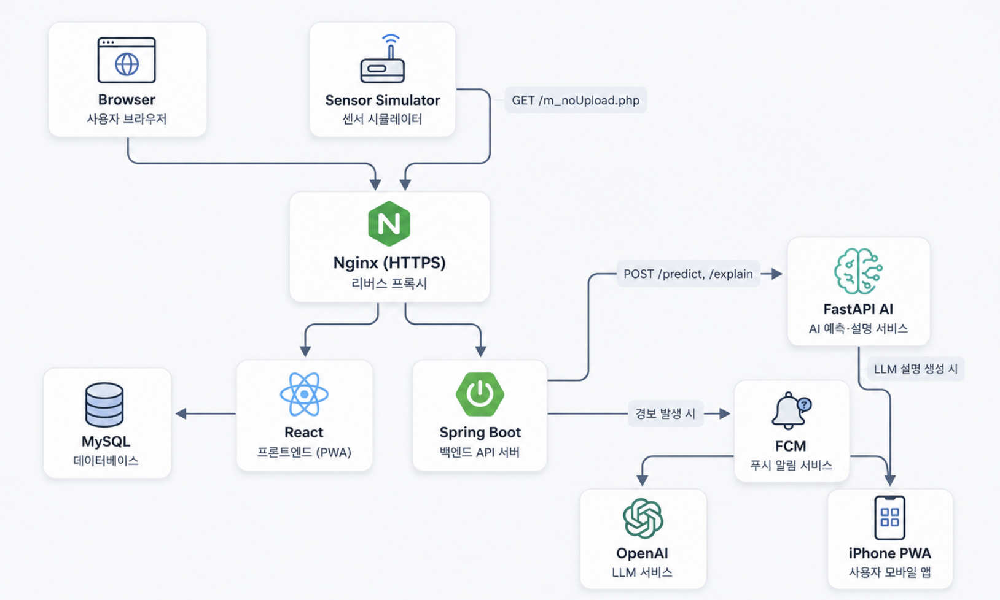

# ArcGuard

ArcGuard는 전기 설비 센서 데이터를 수집하고 ML 기반 위험 진단과 실시간 경보를 제공하는 전기화재 예방 모니터링 포트폴리오입니다.

실제 하드웨어 대신 Sensor Simulator로 장비 통신을 재현했으며, Spring Boot · React · FastAPI · MySQL을 Docker Compose로 구성해 AWS EC2에 배포했습니다. 이 저장소(`firesafety-be`)는 Spring Boot Modular Monolith 백엔드이자 전체 프로젝트의 메인 README입니다.

---

## Live Demo

**https://arcguard.duckdns.org** ([Swagger](https://arcguard.duckdns.org/swagger-ui.html))

| 역할 | 이메일 | 비밀번호 |
|---|---|---|
| 관리자 | admin1@arcguard.com | test1234! |
| 일반 사용자 | user1@arcguard.com | test1234! |

두 계정 모두 `ArcGuard 테스트 현장`에 접근 권한이 있고, Sensor Simulator로 실제 생성한 센서·경보·AI 진단·점검 데이터가 남아 있습니다.

---

## 주요 기능

- 로그인/계정 관리 — 3단계 권한(SUPER_ADMIN/ADMIN/GENERAL), Access/Refresh Token, 비밀번호 재설정
- 현장/분전반/회로 관리, 담당 현장 배정, 감사 이력
- 센서 수신 → 실시간 관제(WebSocket) → 경보 생성
- 경보 상태 전이(미확인→확인→조치완료), FCM 푸시, 일괄 처리, 엑셀 다운로드
- AI 자동/수동 진단, LLM 설명(on-demand + 캐시)
- 점검 관리, 기간별 통계

---

## Architecture



Frontend / Backend / AI Service 3개 저장소를 독립적으로 구성하고,  
GitHub Actions를 통해 테스트 → Docker 이미지 빌드 → GHCR Push → AWS EC2 재배포까지 자동화했습니다.

외부에는 Nginx의 80/443 포트와 관리용 SSH 22 포트만 노출하며,  
Backend · AI Service · MySQL은 직접 외부에 노출하지 않고 Docker 내부 네트워크에서 통신합니다.

---

## AI 진단 구조

ML 판정과 LLM 설명은 완전히 분리되어 있고, LLM은 위험을 재판정하지 않습니다.

| 모델 | 출력 | 의미 |
|---|---|---|
| ARC Classifier | `pred`/`proba` | 아크 여부 |
| Risk Classifier | `riskLevel`/`riskScore` | 종합 위험 수준 — **화재 확률 아님** |
| Anomaly Detector | `anomaly`/`anomalyScore` | 정상 패턴에서 벗어났는지 |
| Next-current Regressor | `predictedCurrent` | 다음 sample 예상 전류(시간 단위 아님) |

진단은 자동(스케줄러) 또는 수동 실행되며, LLM 설명은 사용자가 실제로 조회할 때만 생성되어 DB에 캐시됩니다(같은 진단 재조회 시 OpenAI 재호출 없음).

---

## 인증 / 보안

- HttpOnly Cookie(`at`/`rt`)로 JWT 전달, 원문 대신 해시로 DB 저장
- BCrypt 비밀번호 해시, Refresh Token 서버 측 관리
- 역할 기반 접근 제어 — 요청 값이 아니라 인증된 userId로 매번 DB 재조회해 권한 검증
- HTTPS(Let's Encrypt) 강제, 비밀 값은 전부 `.env`로 분리해 Git에 커밋하지 않음

---

## Tech Stack

Java 21 · Spring Boot · Spring Security(JWT) · MyBatis · MySQL 8.0 · Flyway · WebSocket(STOMP) · OpenFeign · Firebase Admin SDK · Docker · GitHub Actions

---

## Engineering Highlights

**CI에서 production secret 없이 실제 DB까지 검증**
로컬 `.env`가 없는 CI 환경에서 전체 Spring Context 테스트가 실패했다. CI 전용 `mysql:8.0` 컨테이너와 더미 값으로 production과 동일한 엔진에서 실제 Flyway 마이그레이션까지 검증하도록 바꿨다.

**컨테이너 기동 ≠ 서비스 준비**
AI 서비스가 배포 직후 헬스체크에서 실패했다 — IPv6 비활성화 환경에서 `localhost`가 `::1`로도 풀려 오탐을 냈다. 헬스체크 주소를 `127.0.0.1`로 고정하고 재시도(최대 10회)를 추가해, "떴다"가 아니라 "응답 가능"을 배포 성공 기준으로 삼았다.

**LLM 설명 동시 생성 방지**
같은 진단을 여러 사용자가 동시에 처음 열람하면 둘 다 캐시 미스를 보고 각자 AI 서버를 호출할 수 있었다. 저장을 `UPDATE ... WHERE analysis_summary IS NULL` 원자적 쿼리로 바꿔, DB에는 항상 한 건만 반영되게 했다.

**목록에서 클릭한 경보와 실제 처리 대상이 다르던 문제**
모바일에서 알림을 클릭해도, 그 경보가 "최근 5건" 밖에 있으면 다른 최신 경보가 대신 처리되는 버그를 QA 중 발견했다. 목록 조회 API에 `alertId` 단건 필터를 추가해 항상 클릭한 경보 그 자체를 정확히 조회·처리하도록 고쳤다.

---

## Test / QA

```bash
./gradlew test
```

**199개 테스트 전부 통과**(CI에서도 실제 MySQL로 동일하게 검증). Production QA로 HTTPS/쿠키 보안 속성/RBAC(401·403)/Docker 헬스체크/공개 포트 제한/Sensor Simulator 6개 시나리오 E2E/LLM 캐시/FCM(iPhone PWA 실제 수신)까지 직접 확인했습니다.

---

## Scope & Limitations

- 개인 포트폴리오이며, 실제 인증을 받은 전기화재 안전 시스템이 아닙니다.
- 센서 데이터는 실제 하드웨어가 아니라 Sensor Simulator + Synthetic Dataset 기반입니다.
- AI 판정은 보조 진단 정보이며, LLM은 그 결과를 설명할 뿐 위험을 판정하지 않습니다.
- GAS/FIRE 경보의 수치 임계값은 아직 확정되지 않아(TBD) 서버 측 수치 판정은 보류 상태입니다.

---

## Repository

| 저장소 | 역할 |
|---|---|
| [firesafety-be](https://github.com/soyoung-v/firesafety-be) | 백엔드 (이 저장소) |
| [firesafety-fe-react](https://github.com/soyoung-v/firesafety-fe-react) | 프론트엔드 |
| [firesafety-ai](https://github.com/soyoung-v/firesafety-ai) | AI 서버 |

### Local Setup

```bash
cp .env.example .env   # DB/JWT/MAIL 값 채우기
./gradlew bootRun
```

`BOOTSTRAP_SUPER_ADMIN_ENABLED=true`로 두면 `.env`에 설정한 계정으로 SUPER_ADMIN이 로컬에서 자동 생성됩니다(credential은 저장소에 없음). 하드웨어 없이 데모하려면 `SENSOR_MOCK_ENABLED=true`로 가짜 센서 프레임을 주기적으로 생성할 수 있습니다.
